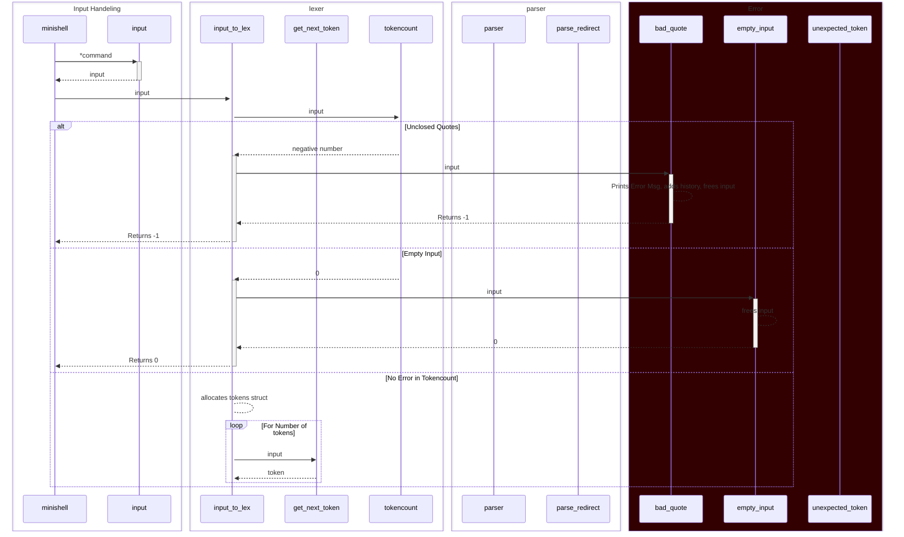

# minishell project

**made by** Jonah Köllner, Maximilian Reidenbach

<br>


# Overview
### - [How to use the minishell](#how-to-use-the-minishell)
- [Building / Executing](#building--executing)
- [Usage](#Usage)

### [Example minishell Sequence](#example-minishell-sequence)


## How to use the minishell

### Building / Executing
```bash
user@pc:~/miniRT$ git clone https://github.com/JonahKoellner/minishell.git
user@pc:~/miniRT$ cd minishell
user@pc:~/miniRT$ make
...
user@pc:~/miniRT$ ./minishell
```
### Usage
``` This minishell is designed to mimic the original bash shell (there can be differences to zsh) so treat it exactly like every other Shell ```

## Example minishell Sequence
<! Needs to be simplified, prob. move this to parser section later>


