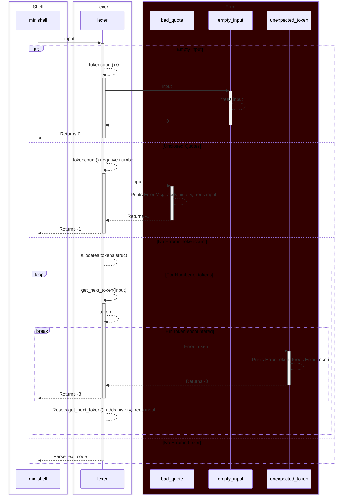

# Lexer

<h2>Error Handeling Lexer </h2>

```mermaid
sequenceDiagram
	box Shell
	participant minishell
	end
	box Lexer
	participant lexer
	end
	box rgb(50,0,0) Error
	participant bad_quote
	participant empty_input
	participant unexpected_token
	end
	minishell->>+lexer: input
	alt Empty Input
		lexer-->>+lexer: tokencount() 0
		lexer->>+empty_input: input
		empty_input-->empty_input: frees input
		empty_input-->>-lexer: 0
		lexer-->>-minishell: Returns 0
	else Unclosed Quotes
		lexer-->>+lexer: tokencount() negative number
		lexer->>+bad_quote: input
		bad_quote-->bad_quote: Prints Error Msg, adds history, frees input
		bad_quote-->>-lexer: Returns -1
		lexer-->>-minishell: Returns -1
	else No Error in Tokencount
		lexer-->lexer: allocates tokens struct
		loop For Number of tokens
			lexer->>+lexer: get_next_token(input)
			lexer-->>lexer: token
			break Err Token encountered
				lexer->>+unexpected_token: Error Token
				unexpected_token-->unexpected_token: Prints Error Token, Frees Error Token
				unexpected_token-->>-lexer: Returns -3
				lexer-->>-minishell: Returns -3
			end
		lexer-->lexer: Resets get_next_token(), adds history, frees input
		end
	else No Error in Lexer
		lexer-->>-minishell: Parser exit code
	end
```
